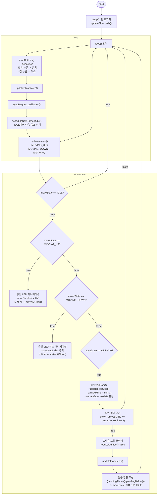

# 엘리베이터 순서도 (Mermaid)

아래 Mermaid 다이어그램은 `elevator.ino`의 주요 동작 흐름을 간단히 표현합니다.
- 사용법: `mermaid.live` 또는 VS Code의 Mermaid Preview에서 붙여넣어 렌더링 후 이미지로 내보내세요.

---

---

간단 설명
- readButtons(): 디바운스 후 짧은 누름은 즉시 요청 등록, 길게 누르면 요청 취소(깜빡임 피드백).
- scheduleNextTargetIfIdle(): IDLE일 때 가장 가까운 요청을 선택(거리가 같으면 위쪽 우선).
- runMovement(): 층간 LED로 애니메이션을 보여주며 층에 도착하면 `arriveAtFloor()`로 전환.
- arriveAtFloor(): 도착 처리(층 LED ON, 도어 열림 시간 대기, 요청 클리어) 후 동일 방향 우선으로 다음 행동 결정.

사용 팁
- Mermaid를 렌더링해 Slides에 쓰려면 mermaid.live에 붙여넣고 PNG로 내보내세요.
- 필요하면 더 상세한 분기(예: pressStartMillis/취소 보호/깜빡임 타이밍)를 추가해 드리겠습니다.
