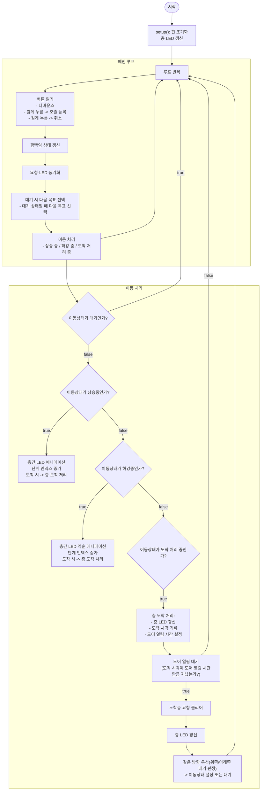

# 엘리베이터 순서도 (Mermaid, 한글화)

아래는 `elevator.ino`의 동작 흐름을 한글 레이블로 정리한 Mermaid 다이어그램입니다.
- mermaid.live 또는 VS Code Mermaid Preview에 붙여넣어 렌더링하세요.

---

---

설명
- 이 다이어그램은 화면에 바로 붙여넣어 사용할 수 있도록 모든 표시 텍스트를 한국어로 작성했습니다.
- 함수 이름 같은 코드는 괄호 안에 그대로 두어 원본 코드와 매핑하기 쉽도록 했습니다.

원하시면 이 Mermaid를 PNG로 렌더해 워크스페이스에 `elevator_flowchart.png`로 저장해 드리겠습니다. (mermaid-cli 또는 웹 렌더러 사용)
